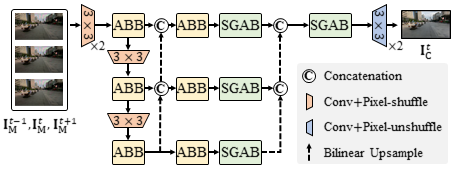

# AVDNet
**[IEEE Signal Processing Letters, 2025] Adaptive Video Demoiréing Network with Subtraction-Guided Alignment**  
Seung-Hun Ok, Young-Min Choi, Seung-Wook Kim, Se-Ho Lee  
[Paper](https://doi.org/10.1109/LSP.2025.3585820) | [Supplementary Materials](https://drive.google.com/file/d/1Bk-R0x-ACmo8sU7rr86cbPRTgkrHsTy5/view?usp=drive_link)

## Introduction
<p align="center">
  
</p>
We propose an adaptive video demoiréing network (AVDNet) that effectively suppresses moiré artifacts while preserving temporal consistency. AVDNet transforms moiré-contaminated frames into temporally consistent clean frames by employing two key components: the adaptive bandpass block (ABB) and the subtraction-guided alignment block (SGAB). First, ABB applies an adaptive bandpass filter (ABF) to each frame, modulated by input-specific coefficients to selectively attenuate moiré frequencies based on the spectral distribution of the input. Then, SGAB aligns consecutive frames by exploiting subtraction maps, which effectively suppresses the propagation of moiré artifacts across time. Experimental results show that AVDNet outperforms existing video demoiréing methods, while maintaining a compact and efficient network architecture.

## Environment
The experiments were conducted using the following software environment and libraries:  
* Python: 3.11.4
* CUDA: 12.1
* PyTorch: 2.1.0
* Torchvision: 0.16.0
* numpy: 1.26.4
* scikit-image
* opencv-python
* deepspeed
* lpips
* tensorboard
* wandb

## Dataset
Our project is based on the **VDmoire** dataset, which is publicly available on [GitHub (CVMI-Lab/VideoDemoireing)](https://github.com/CVMI-Lab/VideoDemoireing).  
After downloading the dataset, please place the folders as follows:
```
project_root/
    ├── AVDNet/
    │   ├── experiments/...
    │   │   ...
    │   └── train.py
    └── datasets/
        ├── homo/...
        └── optical/
            ├── iphone/...
            └── tcl/...
```

## Pretrained Models
You can download the pretrained model for testing from [this link](https://www.dropbox.com/scl/fo/t8w8gfd1hz3m445z3tso2/ACHqeKW5iXnhLSaLlJXCMsY?rlkey=183mti7url38nvrt6gfkaajr5&st=fs9lzkqu&dl=0).  
Please place the downloaded model in the `AVDNet/experiments/` directory before running the test.
> **Note**: If you use the pretrained model provided, be sure to set `strict_load: false` in the test option file, as some class names differ slightly.

## Train/Test
The following is an example command for training on the **iPhone-V1** subset using **GPU 0**:
```
CUDA_VISIBLE_DEVICES=0 python train.py -opt options/train/Train_ipv1.yml
```
The following is an example command for testing on the **TCL-V2** subset using **GPU 3**:
```
CUDA_VISIBLE_DEVICES=3 python test.py -opt options/test/Test_tclv2.yml
```
You can run training or testing by selecting the appropriate `.yml` configuration file and specifying the GPU to use.

## Citation
Please cite the following paper if you use this code in your research:  
```bibtex
@article{ok2025adaptive,
title = {Adaptive Video Demoiréing Network With Subtraction-Guided Alignment},
author = {Ok, Seung-Hun and Choi, Young-Min and Kim, Seung-Wook and Lee, Se-Ho},
journal = {IEEE Signal Processing Letters},
volume = {32},
pages = {2733--2737},
year = {2025}
}
```

## Acknowledgement
Our work was inspired by [MBCNN](https://github.com/zhenngbolun/Learnbale_Bandpass_Filter.git) and [DTNet](https://github.com/rebeccaeexu/DTNet.git).  
We sincerely thank the authors for making their code publicly available.

## Contact
For any questions, please contact: cornking123@jbnu.ac.kr
